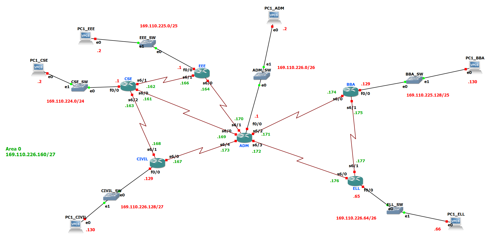
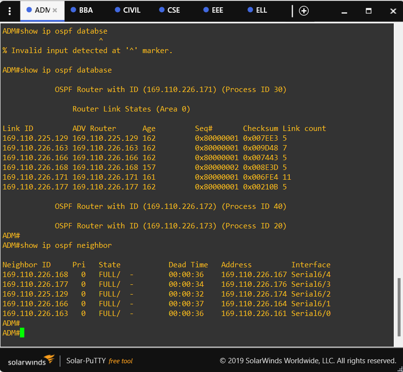

# Campus Network with OSPF (GNS3)

[](https://github.com/salehinafnan/campus-network-ospf/actions/workflows/labcheck.yml)

This is a six-department university campus network built in **GNS3** with
**Cisco 7200** routers. It uses **VLSM** addressing and **OSPF** (single
area 0) routing. It was Project 2 of 3 for the Computer Networks Lab
(CSE-3634) at IIUC, Autumn 2021. Project 1 used static routing; this project
replaced it with OSPF so that routes are learned and repaired automatically.
[Project 3](https://github.com/salehinafnan/campus-network-nat) adds NAT and
DHCP for internet access.



## Design

**Address block:** `169.110.224.0/21`, split with VLSM from the largest
department down to the smallest:

| Department     | Hosts needed | Subnet               | Gateway (router) | Usable range                      |
| -------------- | -----------: | -------------------- | ---------------- | --------------------------------- |
| CSE            |          225 | `169.110.224.0/24`   | `.224.1`         | 169.110.224.1 – 169.110.224.254   |
| EEE            |          100 | `169.110.225.0/25`   | `.225.1`         | 169.110.225.1 – 169.110.225.126   |
| BBA            |           70 | `169.110.225.128/25` | `.225.129`       | 169.110.225.129 – 169.110.225.254 |
| Administrative |           50 | `169.110.226.0/26`   | `.226.1`         | 169.110.226.1 – 169.110.226.62    |
| ELL            |           40 | `169.110.226.64/26`  | `.226.65`        | 169.110.226.65 – 169.110.226.126  |
| Civil          |           28 | `169.110.226.128/27` | `.226.129`       | 169.110.226.129 – 169.110.226.158 |
| Backbone       |      8 links | `169.110.226.160/27` | —                | 169.110.226.161 – 169.110.226.190 |

**Routing:** each department router connects to its LAN on `FastEthernet0/0`
and to its neighbours over serial links. The eight serial links form a
partial mesh around the Administrative router. ADM has five links and every
other router has two or three, so the loss of any single link leaves every
LAN reachable. Each router advertises its LAN and the backbone into OSPF
area 0.

```
router ospf 30
 network 169.110.226.0   0.0.0.63 area 0   ! ADM LAN (/26)
 network 169.110.226.160 0.0.0.31 area 0   ! backbone (/27)
```

OSPF process IDs are local to each router. That's why CSE runs process `20`
while the others run `30`, and they still form adjacencies.

To print the full per-interface plan, generated from the actual configs:

```bash
python3 tools/labcheck.py gns3/project2_0to255.gns3 --table
```

## Results

Every router reached `FULL` adjacency with each of its neighbours. For
example, ADM formed an adjacency on all five of its serial links:



Ping round-trip times between hosts on different departments, in ms, taken
from the report:

| Packet | ADM → CSE | BBA → ADM | CSE → BBA | Civil → ADM | EEE → ELL | ELL → CSE |
| -----: | --------: | --------: | --------: | ----------: | --------: | --------: |
|      1 |   timeout |    61.235 |    70.329 |     timeout |   137.180 |   timeout |
|      2 |   timeout |    60.184 |    61.732 |     timeout |    92.653 |   timeout |
|      3 |    60.063 |    46.594 |    93.088 |      41.584 |    92.776 |    93.665 |
|      4 |    60.613 |    31.067 |    91.534 |      66.545 |    94.694 |    92.953 |
|      5 |    58.821 |    61.357 |    75.340 |      31.265 |    96.022 |    74.606 |

On some paths, the first one or two probes time out while ARP resolves. After
that, every path answers. The full write-up is in
[`docs/Campus Network Using OSPF - report.pdf`](docs/Campus%20Network%20Using%20OSPF%20-%20report.pdf).
It includes the OSPF database, neighbour table and routing table for every
router, plus `debug ip ospf` output.

## Running the lab

1. Install **GNS3 2.2.x**. The project was saved with 2.2.31.
2. Add a Cisco 7200 template that uses `c7200-advipservicesk9-mz.152-4.S5.image`
   (MD5 `cbbbea66a253f1dac0fcf81274dc778d`). Cisco IOS images are licensed,
   so the image isn't included here.
3. Open `gns3/project2_0to255.gns3` and start all nodes. The routers load
   their startup configs from `gns3/project-files/`, and the PCs load their
   addresses from `startup.vpc`.
4. Verify:

   ```
   ADM# show ip ospf neighbor
   ADM# show ip route ospf
   PC1_CSE> ping 169.110.226.130
   ```

## Lab linter

`tools/labcheck.py` is a standard-library Python script. It reads the `.gns3`
topology together with every router and PC config, and checks what you would
otherwise verify by hand in the GNS3 console:

- Both ends of each link are in the same subnet. Switches are followed, so a
  LAN counts as one segment.
- No duplicate IPs, and no router has overlapping interface subnets.
- Every routed interface is advertised by OSPF, and every `network`
  statement matches an interface.
- Wildcards aren't wider than the interface they match.
- Router-to-router links run OSPF on both ends, in the same area, and aren't
  passive.
- Each PC's gateway is a router address on its own segment. DHCP clients have
  a matching `ip dhcp pool`.
- NAT rules point at an `ip nat outside` interface, and the ACL covers the
  inside LAN.

```bash
python3 tools/labcheck.py gns3/project2_0to255.gns3        # checks; exit 1 on any error
python3 tools/labcheck.py gns3/project2_0to255.gns3 --svg topology.svg
python3 -m unittest discover tools                          # linter's own tests
```

GitHub Actions runs both the linter and its tests on every push.

## Design review (2026)

Running the linter on the original configs found no errors, only warnings.
Most were leftovers that I cleaned up, as described in the next section. One
is a real design flaw, and I've kept it as submitted:

**All eight serial links share one `/27`.** Each router has two to five serial
interfaces in `169.110.226.160/27`. OSPF on HDLC point-to-point links tolerates
this, and the adjacencies came up as the screenshot shows. But every router
then treats the whole `/27` as directly connected on several interfaces. As a
result, traffic sent to a serial IP of a non-adjacent router can go down the
wrong link. The standard fix is one `/30` per link, and eight `/30`s fit
exactly into the same `/27`:

| Link                  | Subnet               | End A    | End B      |
| --------------------- | -------------------- | -------- | ---------- |
| CSE s6/0 ↔ ADM s6/0   | `169.110.226.160/30` | CSE .161 | ADM .162   |
| CSE s6/1 ↔ EEE s6/1   | `169.110.226.164/30` | CSE .165 | EEE .166   |
| EEE s6/0 ↔ ADM s6/1   | `169.110.226.168/30` | EEE .169 | ADM .170   |
| ADM s6/2 ↔ BBA s6/0   | `169.110.226.172/30` | ADM .173 | BBA .174   |
| ADM s6/3 ↔ ELL s6/0   | `169.110.226.176/30` | ADM .177 | ELL .178   |
| BBA s6/1 ↔ ELL s6/1   | `169.110.226.180/30` | BBA .181 | ELL .182   |
| CSE s6/2 ↔ Civil s6/1 | `169.110.226.184/30` | CSE .185 | Civil .186 |
| ADM s6/4 ↔ Civil s6/0 | `169.110.226.188/30` | ADM .189 | Civil .190 |

You can generate this table with
`python3 tools/labcheck.py gns3/project2_0to255.gns3 --suggest-p2p 169.110.226.160/27`.
[Project 3](https://github.com/salehinafnan/campus-network-nat) uses this
per-link scheme.

## Repository layout

```
gns3/project2_0to255.gns3        GNS3 project (open this)
gns3/project-files/              router startup configs + VPCS scripts, loaded by GNS3
docs/                            lab report (PDF), topology and results screenshots
tools/labcheck.py                topology/config linter (+ test_labcheck.py)
```

## Team

**Team 0to255:** Mushfiqus Salehin Afnan, Mahir Shadid, Md. Abul
Bashar, Mahafujul Alam and Pritom Saha. Supervised by Abdullahil Kafi, Dept.
of CSE, IIUC.
